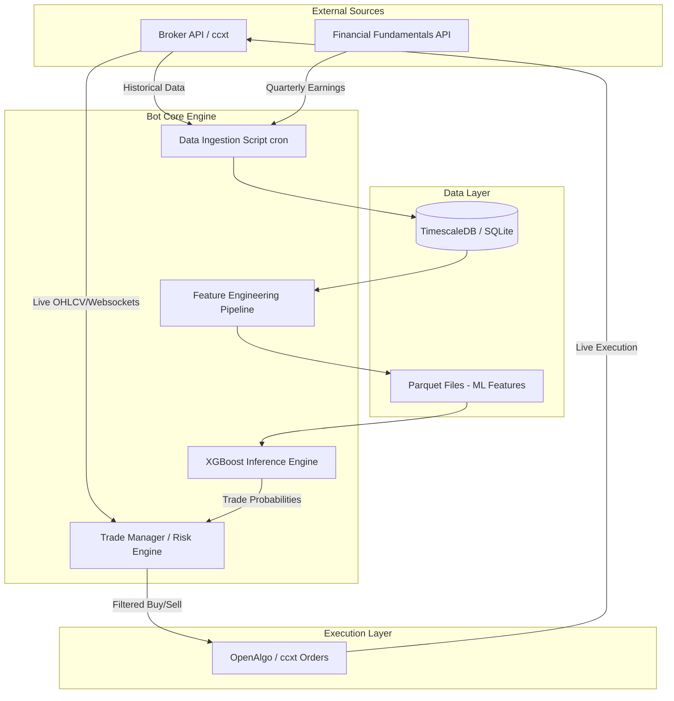

# Engineering Specification: AI Trading Bot Architecture

This document translates high-level trading strategies into a concrete, professional engineering specification. It outlines the exact architecture, data models, technology stack, and step-by-step implementation plan required to build a resilient, production-grade trading bot.

---

## 1. System Architecture

The system is decoupled into three primary microservices: **Data Ingestion**, **Strategy/ML Inference**, and **Execution**. This decoupling prevents API rate limits from crashing the trading logic and allows the ML models to train offline without interrupting live trading.



---

## 2. Core Technology Stack

*   **Language:** Python 3.11+ (Strict type hinting with `mypy`).
*   **Database:** `SQLite` (Development) / `TimescaleDB` (Production for heavy tick data).
*   **Data Manipulation:** `pandas`, `numpy`, `polars` (for faster feature engineering).
*   **Machine Learning:** `xgboost`, `scikit-learn` (for scaling/normalization).
*   **Execution:** 
    *   Crypto: `ccxt` (async mode).
    *   Indian Equities: `openalgo` (Local host proxy to Zerodha Kite/AngelOne).
*   **Orchestration:** `celery` or `APScheduler` for cron jobs (e.g., daily fundamental fetch).

---

## 3. Directory Structure

This is the standard directory structure we will scaffold in `c:\mnp\research\trading_bot_core`.

```text
trading_bot_core/
├── data/
│   ├── raw/                 # Unprocessed OHLCV CSVs/JSONs
│   ├── features/            # Processed Parquet files
│   └── models/              # Pickled XGBoost models (.pkl)
├── core/
│   ├── config.py            # API keys, risk parameters (loads from .env)
│   ├── database.py          # SQLAlchemy ORM and connection pooling
│   └── logger.py            # Standardized JSON logging
├── ingestion/
│   ├── fetch_ohlcv.py       # Async script to pull candle data
│   └── fetch_fundamentals.py# Scrapes/pulls YoY growth, PE ratios
├── strategy/
│   ├── technicals.py        # 200MA, 20EMA, RSI calculations
│   ├── ml_pipeline.py       # Feature generation and XGBoost inference
│   └── risk_manager.py      # Hardcoded 1% rule, max drawdown limits
├── execution/
│   ├── openalgo_client.py   # Indian market order routing
│   └── ccxt_client.py       # Crypto order routing
├── main.py                  # The live trading loop
├── requirements.txt
└── .env                     # EXCLUDED FROM GIT
```

---

## 4. Data Models (Schema)

To ensure data integrity, we will use `SQLAlchemy` for structured storage.

### A. Candle Data (OHLCV)
```python
class Candle(Base):
    __tablename__ = 'candles'
    symbol = Column(String, primary_key=True)
    timestamp = Column(DateTime, primary_key=True)
    timeframe = Column(String) # e.g., '1d', '15m'
    open = Column(Float)
    high = Column(Float)
    low = Column(Float)
    close = Column(Float)
    volume = Column(Float)
```

### B. Trade Journal (Audit Trail)
```python
class TradeRecord(Base):
    __tablename__ = 'trade_journal'
    trade_id = Column(String, primary_key=True)
    symbol = Column(String)
    entry_time = Column(DateTime)
    entry_price = Column(Float)
    position_size = Column(Float)
    stop_loss = Column(Float)
    take_profit = Column(Float)
    ml_probability_score = Column(Float) # Important for later analysis
    status = Column(String) # OPEN, CLOSED_WIN, CLOSED_LOSS
```

---

## 5. The Risk Manager Implementation (Critical Path)

The `risk_manager.py` acts as a firewall between the Strategy and Execution layers. 
It must expose a function that overrides any AI/Strategy buy signal if conditions are unmet.

```python
def calculate_position_size(account_balance: float, current_price: float, stop_loss_price: float, risk_per_trade: float = 0.01) -> float:
    """
    Calculates the exact number of shares/coins to buy so that if the stop loss is hit, 
    the account loses exactly 1%.
    """
    risk_amount = account_balance * risk_per_trade
    price_risk_per_share = abs(current_price - stop_loss_price)
    
    if price_risk_per_share == 0:
        return 0 # Prevent Division by zero
        
    position_size = risk_amount / price_risk_per_share
    return position_size
```

---

## 6. Implementation Plan (Next Steps)

> [!IMPORTANT]
> **User Review Required:** Please review this engineering spec. Once approved, I will proceed with **Phase 1**.

*   **Phase 1: Foundation (Days 1-2)**
    *   Create the exact directory structure.
    *   Setup `requirements.txt` and the SQLite database schema.
    *   Implement `logger.py` and `config.py`.
*   **Phase 2: Data & Risk (Days 3-5)**
    *   Build `fetch_ohlcv.py` to populate the database using `ccxt` or Yahoo Finance.
    *   Implement and unit-test `risk_manager.py` (The 1% rule and position sizing).
*   **Phase 3: Execution Bridge (Days 6-7)**
    *   Implement `openalgo_client.py` and `ccxt_client.py` for dummy/paper trading.
*   **Phase 4: ML Integration (Week 2)**
    *   Introduce `technicals.py` for standard indicators.
    *   Build the `ml_pipeline.py` to train an XGBoost model on historical Parquet files.

---
*Generated following gstack professional engineering standards.*
